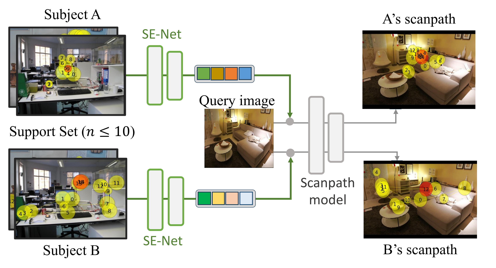

# few-shot-scanpath

CVPR 2025 "Few-shot Personalized Scanpath Prediction"

#### Abstract

A personalized model for scanpath prediction provides insights into the visual preferences and attention patterns of individual subjects. However, existing methods for training scanpath prediction models are data-intensive and cannot be effectively personalized to new individuals with only a few available examples. In this paper, we propose few-shot personalized scanapth prediction task (FS-PSP) and a novel method to address it, which aims to predict scanpaths for an unseen subject using minimal support data of that subject's scanpath behavior. The key to our method's adaptability is the Subject-Embedding Network (SE-Net), specifically designed to capture unique, individualized representations for each user's scanpaths. SE-Net generates subject embeddings that effectively distinguish between subjects while minimizing variability among scanpaths from the same individual. The personalized scanpath prediction model is then conditioned on these subject embeddings to produce accurate, personalized results. Experiments on multiple eye-tracking datasets demonstrate that our method excels in FS-PSP settings and does not require any fine-tuning steps at test time.



#### Results


#### Code
Please refer to readme.md in SE-Net and ISP for detailed implementation.


#### Acknowledgement

[1] Zhibo Yang, Sounak Mondal, Seoyoung Ahn, Ruoyu Xue, Gregory Zelinsky, Minh Hoai, and Dimitris Samaras. Unifying top-down and bottom-up scanpath prediction using transformers. CVPR 2024.

[2] Xianyu Chen, Ming Jiang, and Qi Zhao. Beyond average: Individualized visual scanpath prediction. CVPR 2024.


#### Reference
Please cite if you use this code base.

```bibtex
@article{xue2025few,
  title={Few-shot Personalized Scanpath Prediction},
  author={Xue, Ruoyu and Xu, Jingyi and Mondal, Sounak and Le, Hieu and Zelinsky, Gregory and Hoai, Minh and Samaras, Dimitris},
  journal={arXiv preprint arXiv:2504.05499},
  year={2025}
}

```
